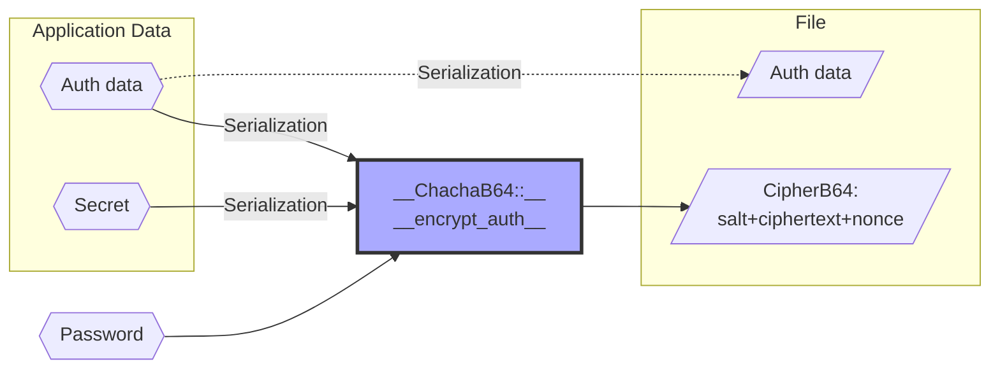
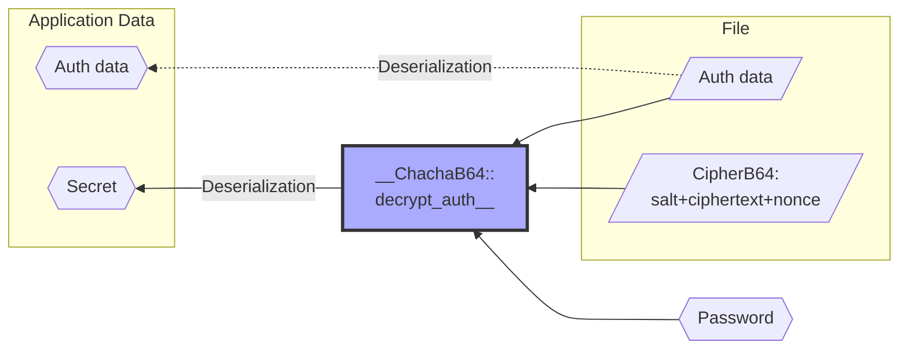

# `pwsec` - support for password-based encryption

[](https://crates.io/crates/pwsec)
[](https://docs.rs/pwsec)
[](https://github.com/emabee/pwsec)
[](https://github.com/emabee/pwsec/actions?query=workflow%3ACI)
[](https://github.com/rust-secure-code/safety-dance/)

## Usage

Add `pwsec` to the dependencies section in your project's `Cargo.toml`:

```toml
[dependencies]
pwsec = "0.5"
```

## Capabilities

`pwsec` uses an (optionally authenticated) encryption scheme.

Two closely related variants are provided currently, `Chacha` and `ChachaB64`.

Alternative variants with similar API and based on other encryption algorithms can be added on demand.

## Example with `ChachaB64` and storage in a file

### Encryption



### Decryption



## Versions

See the change log for more details.

## License

Licensed under either of:

- Apache License, Version 2.0
- MIT license

at your option.
